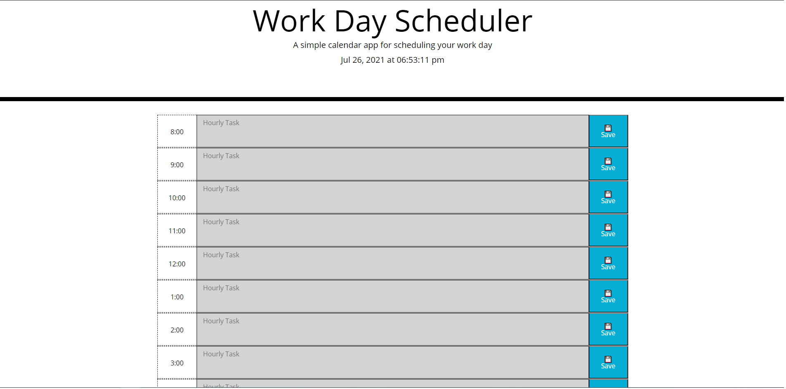

# Homework 5 Work Day Scheduler

## Description
The motivation of this project was to design a work scheduling
program that allows the user to enter tasks into time blocks
corresponding to the hour. The blocks will highlight grey
if the hour is in the past, red if its the current hour, and
green if the hour is in the future.

This project was built to gain experience using APIs such as
jQuery, Bootstrap, and moment.js.

This project implements jQuery, Bootstrap, logic using conditional
statements, moment.js for getting the current time, and setting values 
in local storage.

## Installation
No installation required.

## Usage
Just clone the repository to examine the
code files. To view the website, simply view it by copy and pasting
the GitHub pages link. The link to the live website is:

https://eigenvalue000.github.io/work-day-scheduler/

Screenshot:

   
## Credits
Code provided by Garrett Kegel.
Screenshot provided by Garrett Kegel.
Starter code obtained from Heather Cooper at https://github.com/EdenKhaos , 
which helped me understand where to start.
Beginning code provided by UC Davis Coding Bootcamp, Trilogy Education Services, LLC, a 2U, Inc. brand.

## License
None.